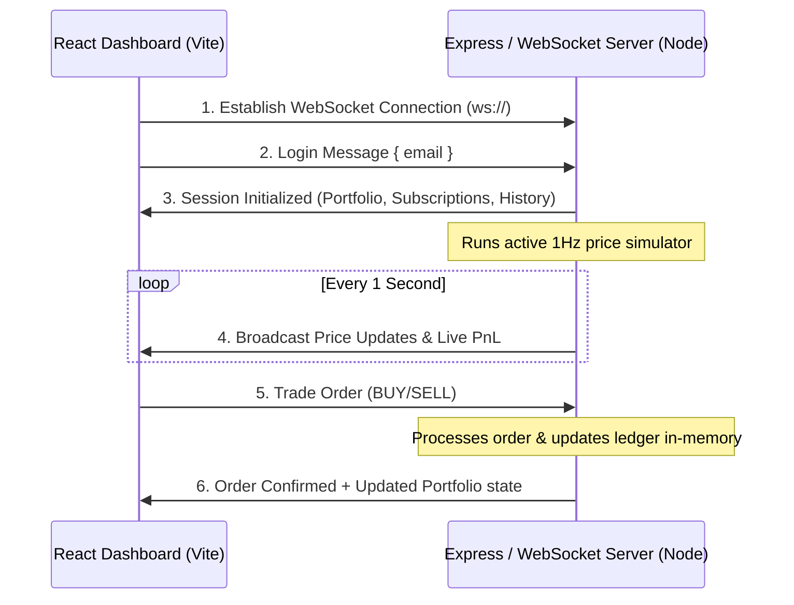

# 📈 StockPulse: Real-Time Paper Trading Dashboard

Welcome to **StockPulse**, a high-fidelity, real-time paper trading dashboard. This application features a real-time WebSocket connection to stream simulated live stock prices, an interactive interface to monitor portfolio performance, and full mock-trading capabilities to execute Buy and Sell orders.

The client is built with **React** and **Vite**, styled with custom **Vanilla CSS** featuring a premium glassmorphic dark-theme UI. The backend is powered by a **Node.js + Express** server running a **WebSocket Server (ws)** for low-latency live telemetry.

---

## 🚀 Key Features

*   **Real-Time Price Telemetry**: Streams stock data (Google, Tesla, Amazon, Meta, NVIDIA) every second via custom WebSockets.
*   **Live Interactive Watchlist**: Easily subscribe or unsubscribe from stocks to dynamically add/remove them from your live view.
*   **Paper Trading Simulator**: Start with **$100,000** in virtual cash and execute `BUY` and `SELL` orders instantly.
*   **Portfolio Breakdown**: Live computation of Net Worth, Cash, Holdings Value, average buy price, and real-time total/percentage Profit & Loss (PnL).
*   **Interactive Analytics**: Every stock card features a dynamic sparkline chart displaying the last 60 seconds of price history, plus live metrics like daily highs, lows, and volume.
*   **Audit Ledger**: A chronological record of all transactions (Buy/Sell operations) with price, quantity, value, and timestamps.
*   **Premium Glassmorphic Design**: Sleek dark mode featuring backdrop blur, glowing accent light spots, responsive grid layouts, and smooth micro-interactions.
*   **Transactional Toast System**: Instant visual confirmation when orders execute, subscription changes occur, or socket connection status changes.

---

## 🛠️ Architecture Overview

The system uses a simple, robust Client-Server architecture over WebSockets:



---

## 📁 Project Directory Structure

```text
cupi/
├── server.js            # Node/Express API Server & WebSocket Server
├── vite.config.js       # Vite configuration with proxy configurations
├── package.json         # Application scripts, dependencies & configurations
├── index.html           # SPA entry container
├── src/
│   ├── main.jsx         # React application bootstrap
│   ├── App.jsx          # Root component & screen router
│   ├── App.css          # Core layouts, components, card UI styles
│   ├── index.css        # CSS variables, animations, background grids & glows
│   ├── context/
│   │   └── AppContext.jsx # Global State Manager (React Context) & WS Manager
│   └── components/
│       ├── LoginScreen.jsx # Secure email login panel
│       ├── Dashboard.jsx   # Layout shell, navbar & main dashboard container
│       ├── StockCard.jsx   # Interactive live-stock card with sparkline and metrics
│       ├── TradeModal.jsx  # Quantity inputs to perform transactions
│       ├── PortfolioView.jsx # Breakdown table of assets & returns
│       ├── OrdersView.jsx  # Execution ledger for historic orders
│       └── ToastContainer.jsx # Animated notification alerts
```

---

## ⚡ Quick Start

### Prerequisites
Make sure you have [Node.js](https://nodejs.org/) installed (version 18+ is recommended).

### 1. Install Dependencies
Navigate to the root directory and install the packages:
```bash
npm install
```

### 2. Run the Development Server
This project uses `concurrently` to launch both the backend node service and the frontend Vite builder with a single command:
```bash
npm run dev
```
*   **Frontend**: Available at [http://localhost:5173](http://localhost:5173)
*   **Backend & WebSocket Server**: Running on [http://localhost:3001](http://localhost:3001)

### 3. Build & Run for Production
To package the frontend assets and run the application in production mode:
```bash
npm run build
npm start
```
The Express server will automatically serve the static optimized bundle from `/dist` on port `3001` (or your system's `PORT` environment variable).

---

## 🎲 Simulation Engine Details

*   **In-Memory Session Database**: All portfolios, balances, and orders are stored in memory mapped to the user's email address. Closing the browser does not lose your session state, provided the backend server remains running!
*   **Market Price Generator**: The backend generates price fluctuations for every supported ticker every second using a random-walk algorithm with a slight bias:
    $$\Delta P = P_{t-1} \times (r - 0.48) \times 3\%$$
    *(where $r$ is a random float between 0 and 1)*
*   **Historical Tracking**: The server keeps the last 60 data points (prices) for each active stock ticker, sending the array to clients so sparklines render immediately upon subscription.
